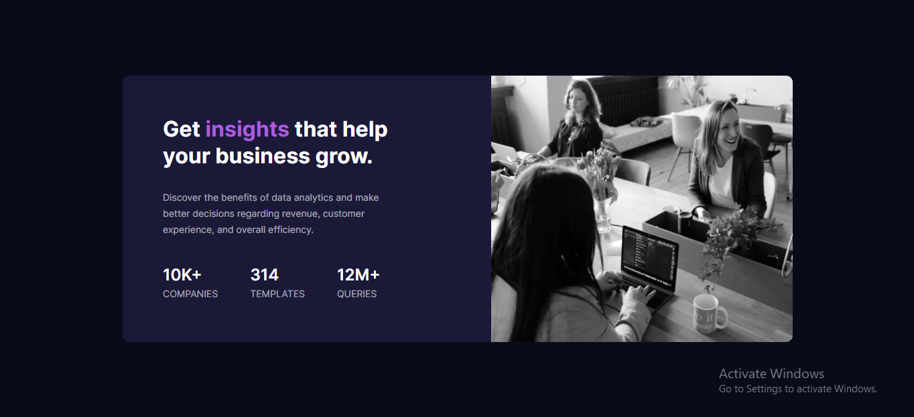
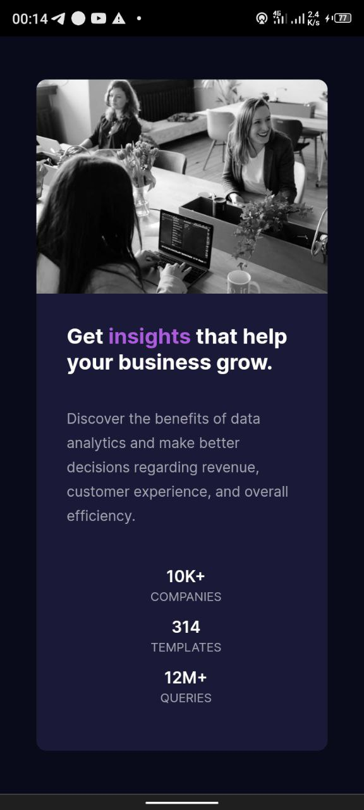

# Frontend Mentor - Stats Preview Card Component

This is a solution to the [Stats Preview Card Component challenge on Frontend Mentor](https://www.frontendmentor.io/challenges/nft-preview-card-component-SbdUL_w0U). Frontend Mentor challenges help you improve your coding skills by building realistic projects. 

## Table of contents

- [Frontend Mentor - Stats Preview Card Component](#frontend-mentor---stats-preview-card-component)
  - [Table of contents](#table-of-contents)
  - [Overview](#overview)
    - [The challenge](#the-challenge)
    - [Screenshot](#screenshot)
    - [Links](#links)
  - [My process](#my-process)
    - [Built with](#built-with)
    - [What I learned](#what-i-learned)
    - [Continued development](#continued-development)
    - [Useful resources](#useful-resources)
  - [Author](#author)
  - [Acknowledgments](#acknowledgments)

## Overview

### The challenge

Users should be able to:

- View the optimal layout depending on their device's screen size
- See hover and focus states for interactive elements

### Screenshot
Design preview for the stats-preview-card-component coding challenge

### Links

- Solution URL: https://github.com/Bidex-03/Stats-preview-card-component
- Live Site URL: https://snazzy-liger-3ff908.netlify.app

## My process

### Built with

- Semantic HTML5 markup
- CSS flexbox
- Desktop-first workflow
- CSS media query for mobile responsiveness

### What I learned

I learnt the proper way to make websites more responsive on devices. It's an avenue to master flexbox also.

### Continued development

I want to learn more on how to use both flexbox and Grid respectively. Moreso, want to learn more on responsiveness.

### Useful resources

(https://www.youtube.com) - This helped me understand the @media query more with well explained tutorials.

## Author

- LinkedIn - [Abdullah Qaasim](https://www.linkedin.com/in/abdullah-qaasim-51b171226?lipi=urn%3Ali%3Apage%3Ad_flagship3_profile_view_base_contact_details%3BN2C4nqpIQt6PtijGCdwv1A%3D%3D)
- Frontend Mentor - [@Bidex-03](https://www.frontendmentor.io/profile/Bidex-03)
- Twitter - [@QaasimAbdullah4](https://www.twitter.com/QaasimAbdullah4)

## Acknowledgments

All thanks to Frontend Mentor community for this big opportunity.
